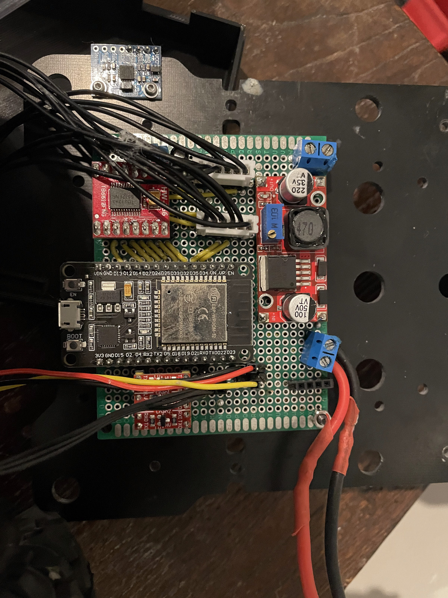

# carbot_drivetrain

ESP32 firmware for my self-driving RC car — the low-level bit that actually makes it move.

It runs a tight control loop on the ESP32: closed-loop PID speed control on two DC motors
(Hall-effect encoders), servo steering, and an RC override for manual driving. It takes
`<rps, steering>` commands from the Jetson over USB/UART and streams wheel-speed telemetry
back.

A hardware pin clock-syncs the ESP32 to ROS2: the Jetson sends a sync pulse, the ESP32
latches its timer to it, and every telemetry line is then timestamped on that shared clock.
That's what lets the wheel data line up with the camera frames when I record runs — i.e.
it's what makes the logged rollouts usable as clean, time-aligned training data.

**Stack:** ESP32 · C++ / Arduino · PlatformIO · FreeRTOS

## Part of the carbot project

- [carbot_ws](https://github.com/tomludbrook10/carbot_ws) — the ROS2 brain that runs the live driving loop
- [carbot_inference](https://github.com/tomludbrook10/carbot_inference) — real-time camera→waypoints model (TensorRT)
- [carbot_action_model](https://github.com/tomludbrook10/carbot_action_model) — trains the image→action model
- [carbot_teleoperation](https://github.com/tomludbrook10/carbot_teleoperation) — remote driving + data recording
